# Bridge Receiver System — Architecture

## Table of Contents

1. [Overview](#overview)
2. [System Components](#system-components)
3. [High-Level Architecture](#high-level-architecture)
4. [Data Structures](#data-structures)
5. [On-Chain Contract Deep Dive](#on-chain-contract-deep-dive)
6. [Off-Chain Relayer Deep Dive](#off-chain-relayer-deep-dive)
7. [Event Indexer](#event-indexer)
8. [Complete Data Flow Walkthroughs](#complete-data-flow-walkthroughs)
9. [Storage Layout](#storage-layout)
10. [Security Model](#security-model)
11. [API Reference](#api-reference)
12. [Configuration Reference](#configuration-reference)
13. [Known Limitations and Production TODOs](#known-limitations-and-production-todos)

---

## Overview

The Bridge Receiver system enables **cross-chain token bridging into the Soroban network**. When a user locks or burns tokens on an external chain (Ethereum, BSC, Polygon, etc.), an authorized off-chain relayer detects the event and submits a *mint signal* to the `bridge_receiver` Soroban smart contract. The contract verifies the signal, records it permanently on-chain, and — once a production proof system is wired in — triggers a mint on the SoroMint token contract.

The system has three major parts:

| Layer | Component | Location |
|---|---|---|
| On-chain | `BridgeReceiverContract` (Rust/Soroban) | `contracts/bridge_receiver/` |
| Off-chain service | `BridgeRelayer` (Node.js) | `server/services/bridge-relayer.js` |
| HTTP API | Bridge routes (Express) | `server/routes/bridge-routes.js` |

The `ProofOfBurnContract` (`contracts/proof_of_burn/`) handles the **outbound** direction: when Soroban tokens are burned to bridge out to another chain, a verifiable on-chain certificate is issued.

---

## System Components

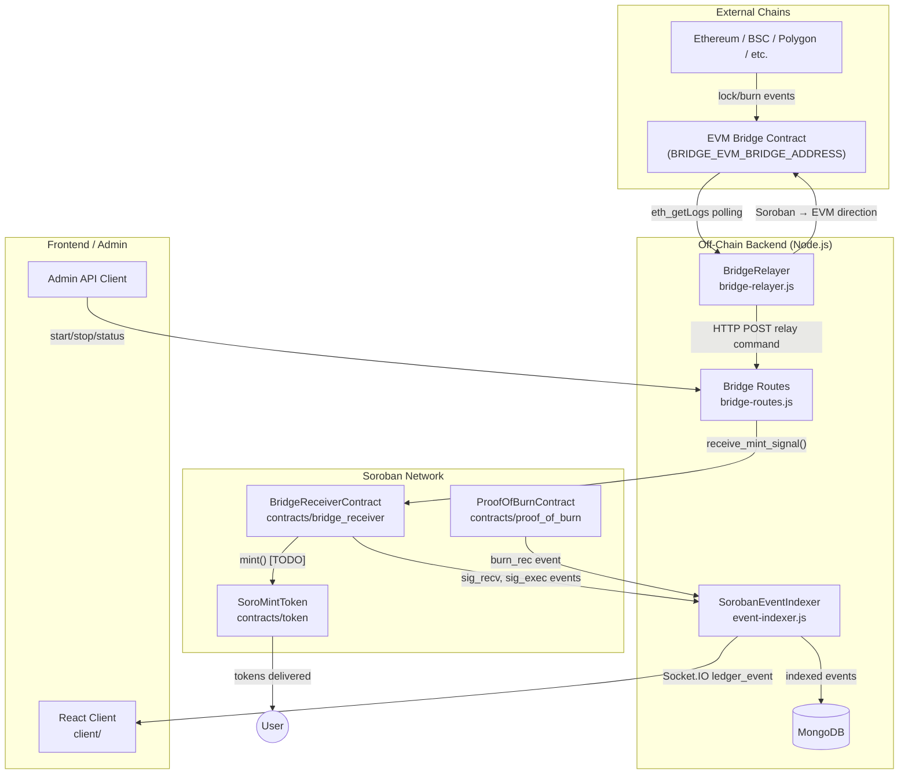

---

## High-Level Architecture

The bridge follows a **lock-and-mint / burn-and-release** model:

- **Inbound (EVM → Soroban):** Tokens are locked on the source chain → relayer detects → mint signal submitted to Soroban → tokens minted to recipient.
- **Outbound (Soroban → EVM):** Tokens are burned on Soroban → burn certificate issued by `ProofOfBurnContract` → relayer detects → tokens released on the target EVM chain.

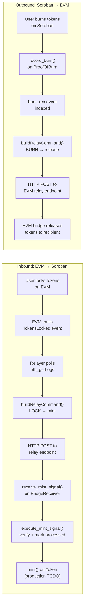

---

## Data Structures

### MintSignal (On-Chain)

The core data structure stored inside `BridgeReceiverContract` for every inbound bridge operation.

```rust
pub struct MintSignal {
    pub signal_id:          u64,          // Auto-incremented on-chain ID
    pub source_chain:       SourceChain,  // Enum: Ethereum | BinanceSmartChain | ...
    pub source_tx_hash:     BytesN<32>,   // 32-byte hash of the source tx (replay key)
    pub recipient:          Address,      // Soroban address to receive minted tokens
    pub token_address:      Address,      // Token contract address to mint into
    pub amount:             i128,         // Amount to mint (in token's smallest unit)
    pub nonce:              u64,          // Caller-supplied nonce
    pub timestamp:          u64,          // Soroban ledger timestamp at receipt
    pub status:             BridgeStatus, // Pending → Verified → Executed / Failed
    pub relayer:            Address,      // The relayer that submitted this signal
    pub verification_proof: Bytes,        // Raw proof bytes (Merkle / multisig / ZK)
}
```

### BridgeStatus Lifecycle

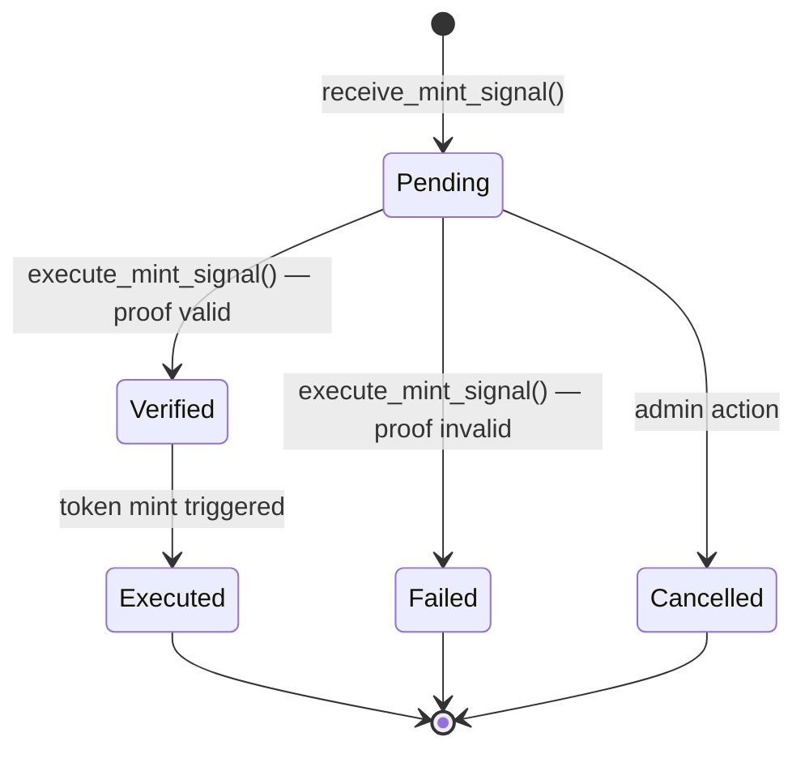

### RelayCommand (Off-Chain)

The normalized command object the `BridgeRelayer` builds before dispatching to a relay endpoint.

```javascript
{
  bridgeId:     string,   // Stable base64-encoded ID derived from event fields
  sourceChain:  string,   // 'evm' | 'soroban'
  targetChain:  string,   // opposite of sourceChain
  sourceAction: string,   // raw action from event (e.g. 'lock', 'burn')
  targetAction: string,   // normalized action ('mint' | 'release' | 'transfer')
  asset: {
    symbol:     string,
    contractId: string,
  },
  amount:       string,
  recipient:    string,
  sender:       string,
  sourceTxHash: string,
  metadata: {
    sourceEventId:   string,
    sourceChainName: string,
    targetChainName: string,
    actionFamily:    string,  // LOCK | RELEASE | MINT | BURN | TRANSFER
    actor:           string,
    timestamp:       string,  // ISO 8601
  },
  originalEvent: object,  // raw event payload (stripped from public status API)
}
```

---

## On-Chain Contract Deep Dive

### Contract Location

```
contracts/bridge_receiver/
├── Cargo.toml
└── src/
    ├── bridge_receiver.rs       ← main implementation
    └── test_bridge_receiver.rs  ← unit tests
```

> **Note:** `bridge_receiver` is not listed in the workspace `Cargo.toml` members. Build it independently: `cargo build -p soromint-bridge-receiver`.

### Initialization

```rust
BridgeReceiverContract::initialize(admin: Address, token_contract: Address)
```

- Sets the admin (also becomes the first authorized relayer).
- Records the `token_contract` address that will be called on mint execution.
- Initializes `NextSignalId` counter to 0.
- Sets `Paused` flag to `false`.

### Relayer Management

Only the admin can add or remove relayers. Relayer status is stored in **persistent** storage (survives ledger expiry resets) as a boolean flag keyed by address.

```rust
add_relayer(admin: Address, relayer: Address)   // → emits rel_add
remove_relayer(admin: Address, relayer: Address) // → emits rel_rem
is_relayer(address: Address) -> bool
```

### Receiving a Mint Signal

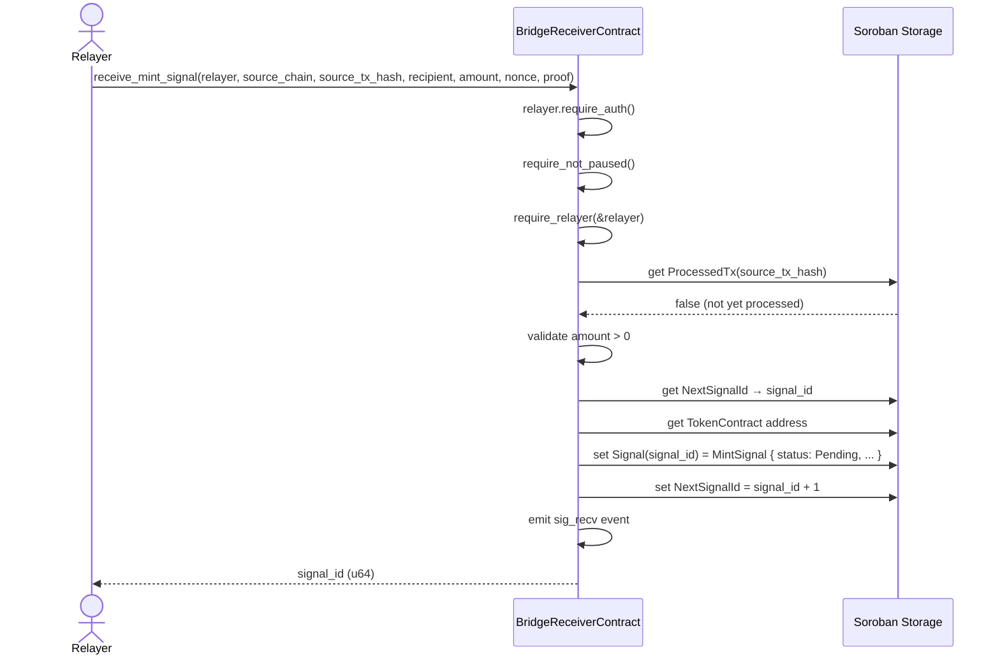

### Executing a Mint Signal

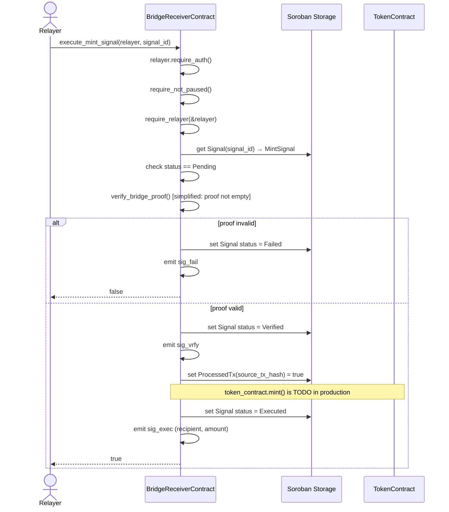

### Events Reference

| Symbol | Topics | Value | When |
|---|---|---|---|
| `sig_recv` | `(sig_recv, signal_id)` | `(source_tx_hash, recipient, amount)` | Signal received |
| `sig_vrfy` | `(sig_vrfy, signal_id)` | `relayer` | Proof verified |
| `sig_exec` | `(sig_exec, signal_id)` | `(recipient, amount)` | Signal executed |
| `sig_fail` | `(sig_fail, signal_id)` | `relayer` | Proof failed |
| `rel_add` | `(rel_add, admin)` | `relayer` | Relayer added |
| `rel_rem` | `(rel_rem, admin)` | `relayer` | Relayer removed |
| `paused` | `(paused,)` | `admin` | Contract paused |
| `unpaused` | `(unpaused,)` | `admin` | Contract unpaused |

---

## Off-Chain Relayer Deep Dive

### BridgeRelayer Class (`server/services/bridge-relayer.js`)

The `BridgeRelayer` is a singleton service that manages two monitoring loops and a command queue.

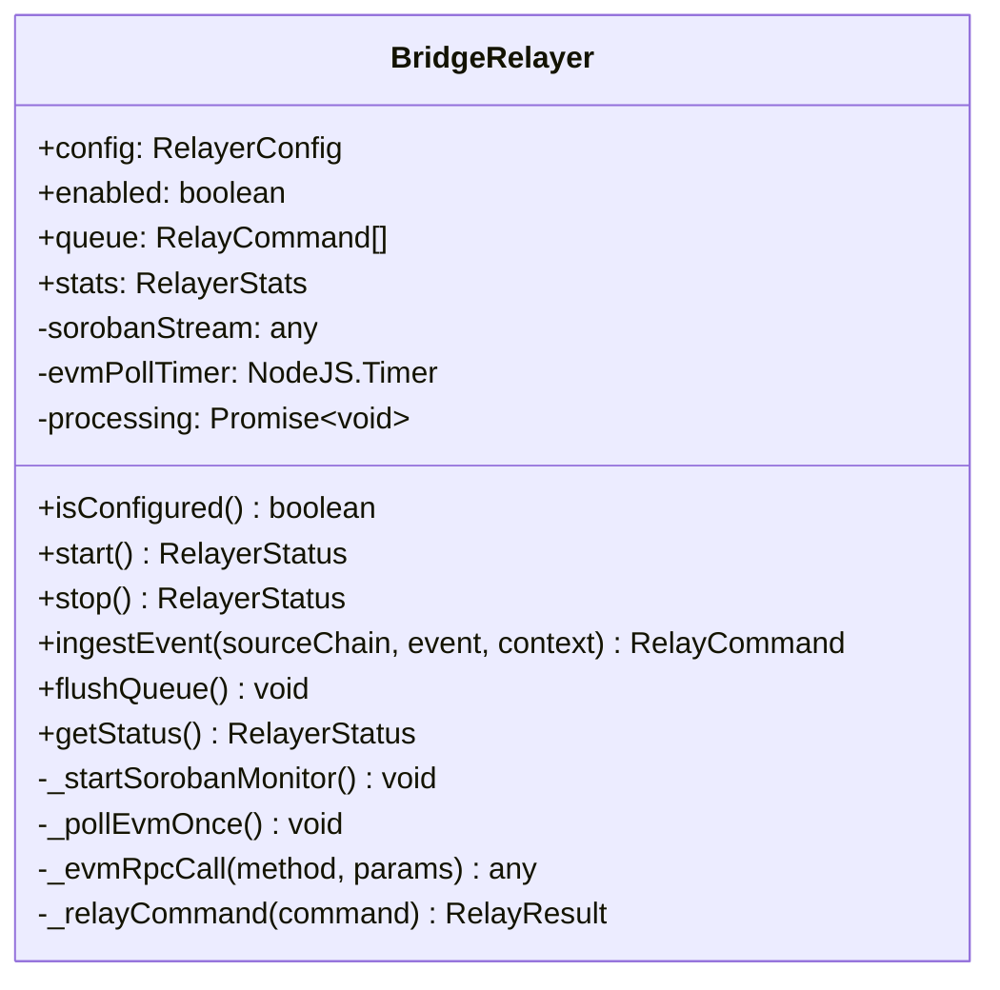

### Event Normalization Pipeline

When `ingestEvent()` is called with a raw event, it passes through `buildRelayCommand()`:

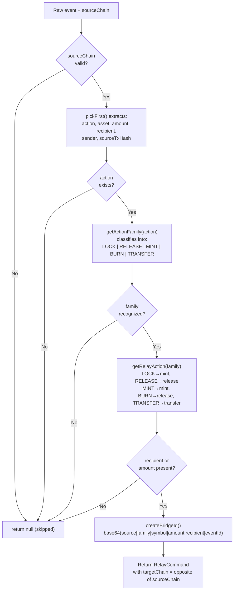

Action family mappings:

| Source Action(s) | Family | Target Action |
|---|---|---|
| `lock`, `deposit`, `bridge.lock`, `bridge_locked` | LOCK | `mint` |
| `release`, `withdraw`, `bridge.release`, `bridge_released` | RELEASE | `release` |
| `mint`, `bridge.mint`, `bridge_mint` | MINT | `mint` |
| `burn`, `bridge.burn`, `bridge_burn` | BURN | `release` |
| `transfer`, `bridge.transfer` | TRANSFER | `transfer` |

### Command Queue and Dispatch

Commands are pushed to an in-memory queue and processed serially by `flushQueue()`. Concurrency is prevented by a `this.processing` promise lock. On each dequeued command, `relayExecutor` (defaults to `_relayCommand`) makes an HTTP POST to the appropriate relay endpoint:

- **EVM target**: uses `BRIDGE_EVM_RELAY_URL` → fallback `BRIDGE_RELAY_ENDPOINT_URL`
- **Soroban target**: uses `BRIDGE_SOROBAN_RELAY_URL` → fallback `BRIDGE_RELAY_ENDPOINT_URL`

The request includes the full `RelayCommand` as JSON body and a `X-SoroMint-Bridge-Id` header for traceability.

### EVM Polling

The EVM side uses `eth_getLogs` via JSON-RPC with exponential backoff retry (`retryWithBackoff` utility):

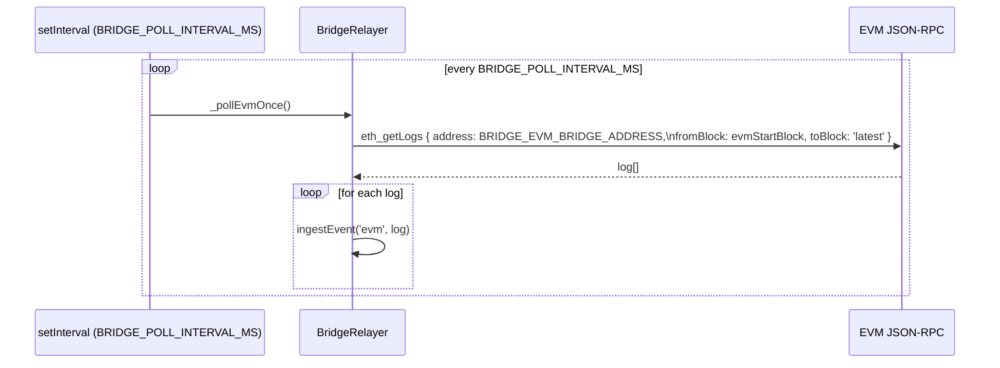

### Soroban Monitoring

`_startSorobanMonitor()` is currently a structural placeholder. The Soroban → EVM direction logs initialization but does not yet connect to a Soroban RPC event stream. When implemented, it should subscribe to Soroban contract events from `BRIDGE_SOROBAN_ACCOUNT_ID` and feed them into `ingestEvent('soroban', event)`.

---

## Event Indexer

The `SorobanEventIndexer` (`server/services/event-indexer.js`) is a separate background process that provides a general-purpose Soroban event pipeline. It is not bridge-specific but is the mechanism by which bridge contract events become queryable off-chain.

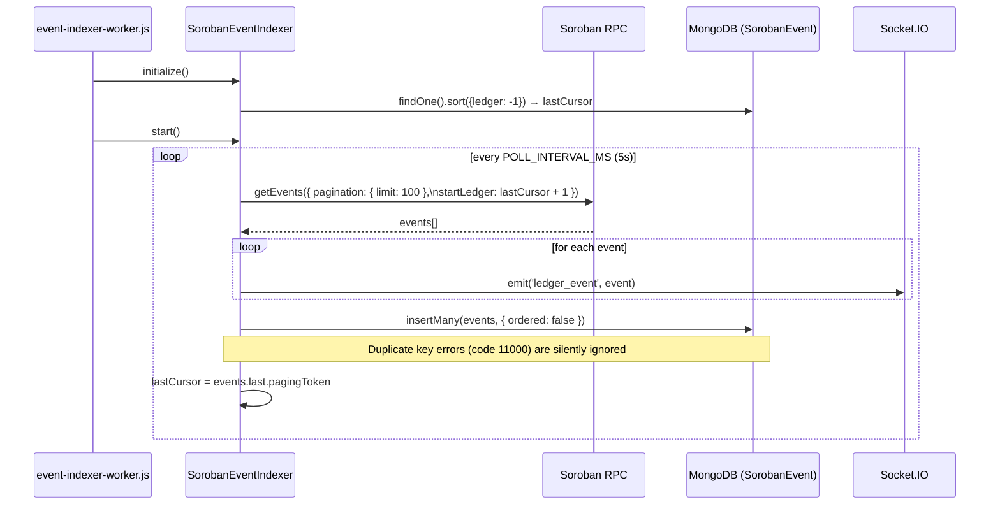

To filter bridge receiver events from the general event stream, query the `SorobanEvent` collection by `contractId` equal to the deployed `bridge_receiver` contract address.

---

## Complete Data Flow Walkthroughs

### Walkthrough 1: EVM → Soroban (Inbound Bridge)

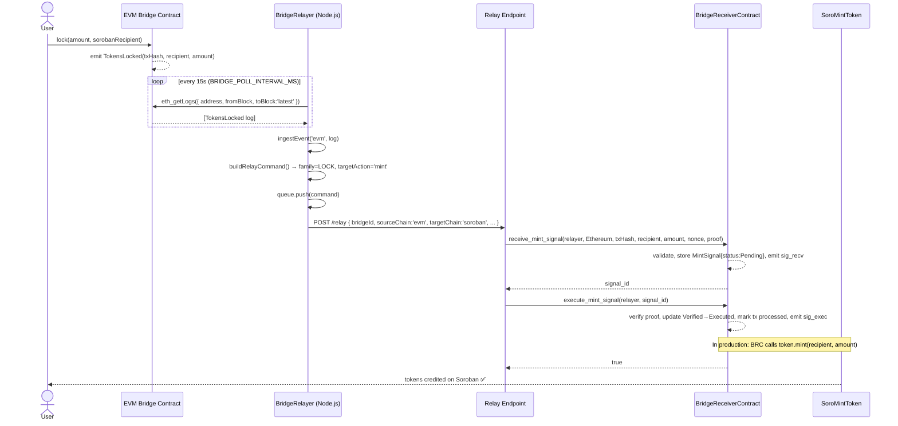

### Walkthrough 2: Soroban → EVM (Outbound Bridge)

```mermaid
sequenceDiagram
    actor User
    participant Token as SoroMintToken
    participant POB as ProofOfBurnContract
    participant Indexer as SorobanEventIndexer
    participant Relayer as BridgeRelayer
    participant EVMBridge as EVM Bridge Contract

    User->>Token: burn(amount)
    Token-->>Token: emit burn event

    User->>POB: record_burn(burner, token, amount, CrossChainBridge, txHash, metadata)
    POB-->>POB: create BurnCertificate, emit burn_rec

    Indexer->>POB: getEvents (polling)
    POB-->>Indexer: burn_rec event
    Indexer->>Indexer: ingestEvent('soroban', event)
    Note over Indexer: _startSorobanMonitor() not yet implemented;\nthis path uses the general event indexer

    Indexer->>Relayer: (via internal call or webhook) ingestEvent('soroban', burn_event)
    Relayer->>Relayer: buildRelayCommand() → family=BURN, targetAction='release'
    Relayer->>EVMBridge: POST /evm-relay { targetAction:'release', recipient, amount, ... }
    EVMBridge-->>User: tokens released on EVM ✅
```

---

## Storage Layout

### On-Chain (Soroban Persistent Storage)

```
DataKey::Signal(signal_id: u64)           → MintSignal
DataKey::ProcessedTx(hash: BytesN<32>)    → bool
DataKey::Relayer(address: Address)        → bool
```

### On-Chain (Soroban Instance Storage)

```
DataKey::NextSignalId   → u64
DataKey::TokenContract  → Address
DataKey::Admin          → Address
DataKey::Paused         → bool
```

> **Storage tier choice:** `Signal`, `ProcessedTx`, and `Relayer` use **persistent** storage because they must survive across ledger epochs. The counter, token address, admin, and pause flag use **instance** storage as they are accessed on every call and benefit from the cheaper footprint.

### Off-Chain (MongoDB)

The general `SorobanEvent` collection stores all indexed events. Bridge-specific events can be filtered by `contractId`.

```
Collection: soroban_events
{
  contractId:             string,   // bridge_receiver contract address
  eventType:              string,   // 'sig_recv' | 'sig_exec' | 'sig_fail' | ...
  ledger:                 number,
  ledgerClosedAt:         Date,
  txHash:                 string,
  topics:                 array,
  value:                  object,   // XDR-decoded event value
  pagingToken:            string,   // cursor for resumption
  inSuccessfulContractCall: bool,
}
```

---

## Security Model

### Threat Model

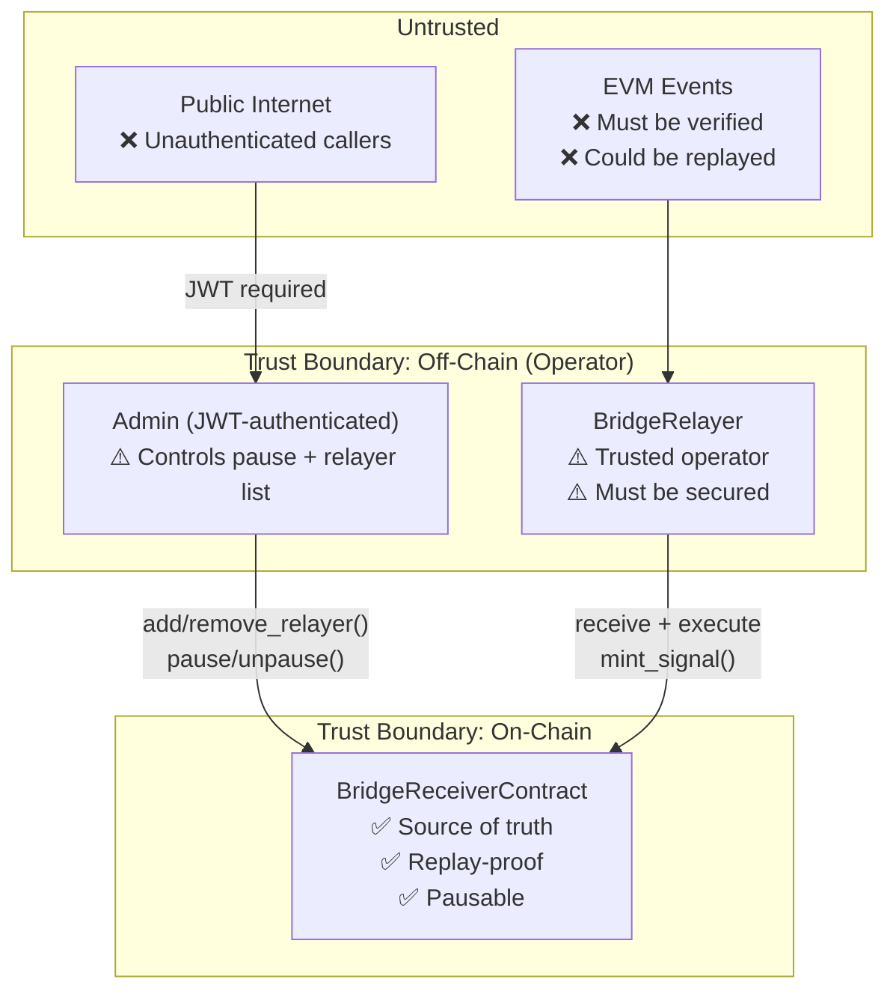

### Defense Layers

**1. Replay Protection**

Every `source_tx_hash` is stored in `DataKey::ProcessedTx` after a signal is executed. Any attempt to re-submit the same source transaction hash panics immediately:

```rust
if is_tx_processed(e, &source_tx_hash) {
    panic!("Transaction already processed");
}
```

**2. Relayer Allowlist**

Only addresses explicitly added by the admin can call `receive_mint_signal` or `execute_mint_signal`. The `require_relayer()` guard is enforced at the start of both functions.

**3. Emergency Pause**

The admin can halt all inbound bridge operations instantly via `pause()`. All `receive_mint_signal` and `execute_mint_signal` calls revert while paused. This is the primary incident response tool.

**4. API Authentication**

All bridge management routes (`/api/bridge/relayer/*`) require a valid JWT. The reset endpoint additionally requires `role === 'admin'`.

**5. Input Validation**

The `validateBridgeEvent` middleware uses Zod schemas to reject malformed payloads before they reach the relayer service. The `sourceChain` field is an enum — only `'soroban'` and `'evm'` are accepted.

### Production Hardening Recommendations

The current proof verification is intentionally simplified (`verify_bridge_proof` only checks that the `Bytes` value is non-empty). For production, implement one or more of:

- **Merkle inclusion proofs**: Verify that `source_tx_hash` appears in a finalized block's transaction Merkle tree using a trusted root supplied by a light client or oracle.
- **Multi-relayer threshold**: Require M-of-N independent relayers to submit corroborating signals before execution, removing single-relayer trust.
- **ZK proofs**: For privacy-preserving bridges, accept a zero-knowledge proof of correct execution on the source chain.
- **Challenge period**: Introduce a time window after `receive_mint_signal` during which the signal can be disputed before execution.
- **Admin timelock**: Wrap admin actions (adding relayers, unpausing) in a timelock contract to prevent immediate exploitation of a compromised admin key.

---

## API Reference

All routes are under `/api/bridge/relayer` and require `Authorization: Bearer <JWT>`.

### `GET /api/bridge/relayer/status`

Returns current relayer state and queue metrics.

**Query params:**
- `detailed=true` — include `originalEvent` in each queued command

**Response 200:**
```json
{
  "success": true,
  "data": {
    "enabled": false,
    "configured": false,
    "direction": "both",
    "queue": { "pending": 0, "processing": 0 },
    "stats": {
      "observed": 0,
      "skipped": 0,
      "relayed": 0,
      "failed": 0,
      "lastObservedAt": null,
      "lastRelayedAt": null,
      "lastError": null
    },
    "config": {
      "sorobanAccountId": "GABCD...",
      "evmBridgeAddress": "0xabcd..."
    }
  }
}
```

### `POST /api/bridge/relayer/start`

Starts EVM polling and Soroban monitoring loops.

**Response 202:** relayer started  
**Response 400:** `BRIDGE_RELAYER_ENABLED` or required addresses not configured  
**Response 500:** start error (see `details`)

### `POST /api/bridge/relayer/stop`

Stops all monitoring, flushes the queue, and returns final status.

### `POST /api/bridge/relayer/simulate`

Dry-run: ingest an event without affecting live relay endpoints. Useful for testing event normalization.

**Body:**
```json
{
  "sourceChain": "evm",
  "event": {
    "action": "lock",
    "symbol": "USDC",
    "amount": "1000000",
    "recipient": "GABCDEF...",
    "txHash": "0xabc123..."
  },
  "metadata": {}
}
```

**Response 200:** no command built (event skipped during normalization)  
**Response 202:** command built and returned

### `POST /api/bridge/relayer/ingest`

Production endpoint for external sources pushing bridge events. Always returns 202 (accepted) even if processing fails, to avoid source-chain retries exposing internal errors.

### `POST /api/bridge/relayer/reset`

Admin-only. Clears the in-memory queue and resets all stats counters. Does **not** affect on-chain state.

---

## Configuration Reference

All bridge configuration is via environment variables. See `server/.env.example` for the full template.

| Variable | Required | Default | Description |
|---|---|---|---|
| `BRIDGE_RELAYER_ENABLED` | Yes | `false` | Master switch — set `true` to activate |
| `BRIDGE_RELAYER_DIRECTION` | No | `both` | `both` \| `evm-to-soroban` \| `soroban-to-evm` |
| `BRIDGE_SOROBAN_ACCOUNT_ID` | Yes* | — | Soroban account to monitor for outbound events |
| `BRIDGE_SOROBAN_RPC_URL` | No | falls back to `SOROBAN_RPC_URL` | Soroban JSON-RPC endpoint |
| `BRIDGE_EVM_RPC_URL` | Yes* | — | EVM JSON-RPC endpoint (e.g. Alchemy, Infura) |
| `BRIDGE_EVM_BRIDGE_ADDRESS` | Yes* | — | EVM bridge contract address to poll |
| `BRIDGE_EVM_START_BLOCK` | No | `0` | Block number to start `eth_getLogs` from |
| `BRIDGE_POLL_INTERVAL_MS` | No | `15000` | EVM polling interval in milliseconds |
| `BRIDGE_RELAY_ENDPOINT_URL` | Yes* | — | Default HTTP endpoint for relay command dispatch |
| `BRIDGE_EVM_RELAY_URL` | No | falls back to `BRIDGE_RELAY_ENDPOINT_URL` | EVM-specific relay URL |
| `BRIDGE_SOROBAN_RELAY_URL` | No | falls back to `BRIDGE_RELAY_ENDPOINT_URL` | Soroban-specific relay URL |

> \* Required when the corresponding direction is active.

The deployed `bridge_receiver` contract address is needed by the relay endpoint to call `receive_mint_signal`. Add `BRIDGE_SOROBAN_CONTRACT_ID` to your environment (not yet in `.env.example`).

---

## Known Limitations and Production TODOs

The following items are explicitly incomplete in the current codebase and must be addressed before production deployment.

### Critical

1. **Token mint is not executed**

   `execute_mint_signal()` updates the signal status to `Executed` and emits `sig_exec`, but the actual call to the token contract is commented out:

   ```rust
   // token_contract.mint(signal.recipient, signal.amount);
   ```

   To implement this, create a client for the token contract and call `minter_mint()`. The `bridge_receiver` contract address must be granted a minter limit via `SoroMintToken::set_minter_limit()`.

2. **Proof verification is not cryptographic**

   `verify_bridge_proof()` only checks `!signal.verification_proof.is_empty()`. Any non-empty byte string passes. A Merkle proof verifier, multisig verifier, or ZK verifier must replace this before mainnet.

3. **Soroban monitoring is a placeholder**

   `_startSorobanMonitor()` logs initialization but does not connect to Soroban event streaming. The Soroban → EVM direction is not operational.

### Non-Critical

4. `bridge_receiver` is excluded from the workspace build (`Cargo.toml` members list). It must be built and deployed separately: `cargo build -p soromint-bridge-receiver`.

5. `BRIDGE_SOROBAN_CONTRACT_ID` is missing from `server/.env.example`. Add it to document the contract address requirement.

6. The in-memory command queue does not survive process restarts. Consider persisting queued commands to Redis or MongoDB for durability.

7. No relayer fee mechanism exists. Relayers currently operate without economic incentive or slashing for misbehavior.
