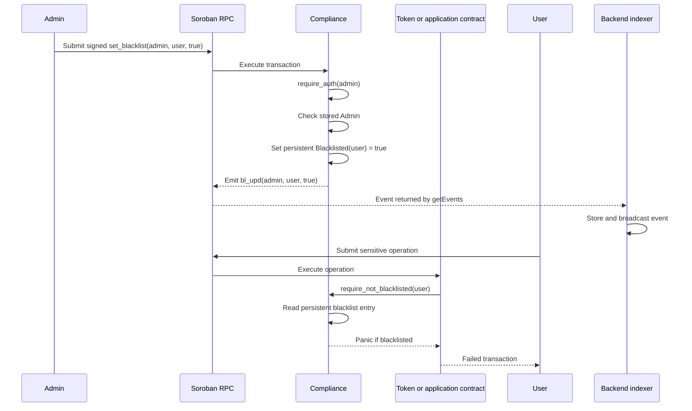
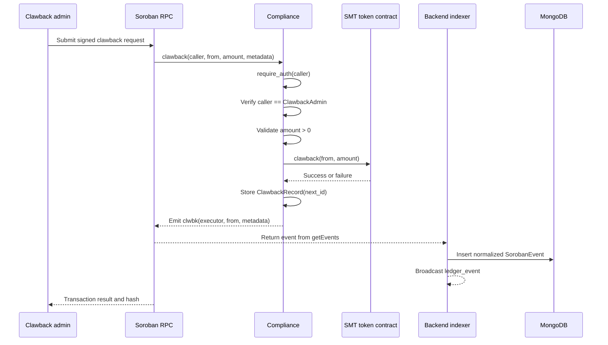
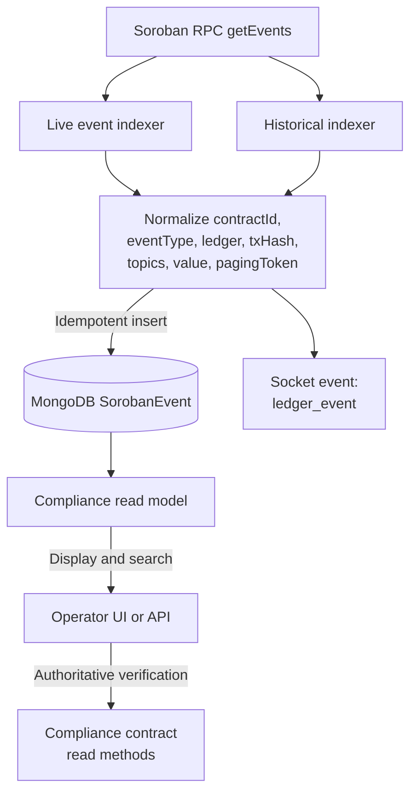

# Compliance Architecture

This document describes the SoroMint Compliance system as implemented by the Soroban contract and the off-chain event indexer. The Compliance contract is the source of truth for enforcement and audit records. The backend provides discovery, persistence, and notification around on-chain state; it does not replace contract authorization or blacklist checks.

## Scope and Responsibilities

The system has three cooperating layers:

- **Soroban network**: Executes the Compliance contract and the SMT token contract atomically. Authorization, blacklist state, clawback execution, audit records, and compliance events are on-chain.
- **Compliance contract**: Owns compliance configuration and decisions. It stores the administrator, clawback administrator, token contract address, default jurisdiction, blacklist entries, and clawback records.
- **Off-chain backend**: Polls Soroban RPC for all events, stores normalized events in MongoDB, and broadcasts them through the existing `ledger_event` socket channel. Consumers can build dashboards and read models from this data, but must treat the chain as authoritative.

The current backend indexer is generic. It does not contain a Compliance-specific route or policy engine. Compliance-aware API endpoints can be built on top of the indexed `contractId`, `eventType`, `topics`, and `value` fields.

```mermaid
flowchart LR
    Admin[Administrator or
    compliance operator]
    User[Wallet or
    application client]
    Backend[Off-chain backend]
    RPC[Soroban RPC]
    Compliance[Compliance contract]
    Token[SMT token contract]
    Mongo[(MongoDB
    SorobanEvent)]
    Clients[Dashboards and
    downstream consumers]

    Admin -->|Signed admin transaction| RPC
    User -->|Signed token transaction| RPC
    RPC --> Compliance
    RPC --> Token
    Compliance -->|Blacklist guard is called by
    integrating contracts| Compliance
    Compliance -->|clawback(from, amount)| Token
    Compliance -->|Events and state| RPC
    Token -->|Events and state| RPC
    RPC -->|getEvents polling| Backend
    Backend --> Mongo
    Backend -->|ledger_event| Clients
    Mongo --> Clients
```

## On-Chain Data Model

The Compliance contract uses Soroban instance storage for configuration and audit records, and persistent storage for blacklist entries.

| Key | Storage | Value | Purpose |
| --- | --- | --- | --- |
| `Admin` | Instance | `Address` | Address authorized to change compliance configuration. |
| `ClawbackAdmin` | Instance | `Address` | Address authorized to execute clawbacks. |
| `TokenAddress` | Instance | `Address` | SMT token contract called by `clawback`. |
| `DefaultJurisdiction` | Instance | `Jurisdiction` | Jurisdiction used when a clawback omits one. |
| `ClawbackCounter` | Instance | `u64` | Monotonic counter for audit record IDs. |
| `ClawbackRecord(id)` | Instance | `ClawbackRecord` | Detailed, queryable clawback audit record. |
| `Blacklisted(address)` | Persistent | `bool` | Presence and value indicate that an address is blacklisted. |

A `ClawbackRecord` contains the record ID, source address, burned amount, reason, jurisdiction, optional legal reference, optional notes, ledger timestamp, and executing address. Record IDs start at one and are incremented after a successful token call.

### Lifecycle and authority

1. `initialize` can run only once. It establishes the admin, clawback admin, token address, counter, and default jurisdiction.
2. The admin must authenticate with Soroban authorization for `set_blacklist`, `set_admin`, `set_clawback_admin`, `set_token_address`, and `set_default_jurisdiction`.
3. The clawback admin must authenticate and equal the stored `ClawbackAdmin` for `clawback`.
4. Public read methods such as `is_blacklisted`, `get_clawback_record`, and `get_recent_clawbacks` read contract state and do not delegate trust to the backend.
5. The Compliance contract exposes `require_not_blacklisted` as a guard. A token or application contract must invoke that guard in its own sensitive entry points; storing a blacklist entry alone does not automatically intercept every contract call in the network.

## Blacklist Enforcement

Blacklist management changes state in the Compliance contract. When `banned` is true, the contract writes `Blacklisted(addr)` to persistent storage. When it is false, the key is removed. Both transitions emit `bl_upd` with the administrator as a topic and `(address, banned)` as event data.

The guard is intentionally explicit. An integrating contract calls `require_not_blacklisted` before performing an operation such as a transfer or mint. If the address is blacklisted, the call panics with `Address is blacklisted`, and the enclosing Soroban transaction fails.



A blacklist event is evidence that a state transition was emitted, but consumers should confirm the current state with `is_blacklisted` when correctness matters. Events can be delayed in the backend, and a consumer may be rebuilding its local read model.

## Clawback Flow

A clawback is a synchronous cross-contract call followed by an on-chain audit write:

1. The caller authenticates and is compared with the configured `ClawbackAdmin`.
2. The amount must be positive and the token contract address must be configured.
3. The Compliance contract invokes the token contract's `clawback(from, amount)` entry point.
4. If the token call succeeds, the Compliance contract creates the next `ClawbackRecord` and stores it.
5. The contract emits `clwbk` with executor and source address topics. Event data contains amount, string reason, jurisdiction, optional legal reference, optional notes, and the ledger timestamp.
6. If any required authorization, validation, or contract call fails, the transaction fails and the record is not written.

The optional jurisdiction falls back to `DefaultJurisdiction`. Supported reason values include fraud, sanctions, court order, regulatory enforcement, AML seizure, terrorism financing, tax evasion, and other legal requirements.



The token burn and audit record are part of the same Soroban transaction. A backend record is therefore a projection of an on-chain event, not the authorization record itself. For an audit workflow, retain the transaction hash, ledger, contract ID, and event payload, and reconcile them against the contract's `get_clawback_record` methods.

## Off-Chain Indexing and Read Models

The event indexer connects to MongoDB, creates a Soroban RPC client from `SOROBAN_RPC_URLS` or `SOROBAN_RPC_URL`, and polls `getEvents` in batches. It currently requests all events and advances from the latest indexed position. Each event is normalized into `SorobanEvent` with:

- `contractId`: originating Soroban contract
- `eventType`: first topic, such as `bl_upd` or `clwbk`
- `ledger` and `ledgerClosedAt`: chain ordering and timestamp information
- `txHash`: transaction identity
- `topics`: complete topic array
- `value`: event data
- `pagingToken`: idempotency cursor
- `inSuccessfulContractCall`: whether the event came from a successful call

The historical indexer uses `INDEXER_START_LEDGER` to rebuild the same collection from a known ledger. Inserts are idempotent through the unique paging token. This gives contributors a recovery path when the live indexer is unavailable or when a read model must be rebuilt.



### Consumer rules

- Filter by the deployed Compliance `contractId` before interpreting an event.
- Use `eventType` values `bl_upd`, `clwbk`, `cfg_upd`, `token_set`, and `cb_admin` to classify Compliance activity.
- Keep `txHash` and `ledger` with every derived record so a projection can be traced back to the network.
- Treat `inSuccessfulContractCall: false` as non-authoritative for state projections unless the consumer has a deliberate failure-audit use case.
- Do not authorize a transaction from MongoDB state. Read current on-chain state or submit a signed Soroban transaction and let the contract enforce the rule.
- Design consumers to tolerate duplicate delivery and replay. The indexer broadcasts events before inserting them, while MongoDB deduplicates by paging token.
- Reconcile important clawback records with `get_clawback_record`, `get_recent_clawbacks`, or `get_clawbacks_for_address`.

## Configuration and Event Reference

| Operation | Authorization | Event | Event shape |
| --- | --- | --- | --- |
| `set_blacklist` | Admin | `bl_upd` | Topics: symbol, admin. Data: address, boolean. |
| `clawback` | Clawback admin | `clwbk` | Topics: symbol, executor, source. Data: amount, reason, jurisdiction, legal reference, notes, timestamp. |
| `set_default_jurisdiction` | Admin | `cfg_upd` | Topics: symbol, admin. Data: field, old value, new value. |
| `set_token_address` | Admin | `token_set` | Topics: symbol, admin. Data: token address. |
| `set_clawback_admin` | Admin | `cb_admin` | Topics: symbol, admin. Data: new clawback admin. |

There is no separate whitelist data structure in the current contract. An address is allowed by default unless it is blacklisted and the integrating contract invokes the guard. Likewise, the backend does not independently maintain an allow/deny policy.

## Failure and Recovery Considerations

A failed blacklist update does not change the blacklist state. A failed clawback does not create a Compliance audit record because the record write follows the token contract invocation. A backend outage does not roll back successful Soroban transactions; it creates indexing lag that can be repaired with the historical indexer.

When diagnosing a discrepancy:

1. Identify the Compliance contract ID and transaction hash.
2. Query Soroban RPC or the contract read method for current state.
3. Check whether the relevant event exists on-chain and whether the contract call succeeded.
4. Compare the event's ledger and paging token with the MongoDB record.
5. Rebuild from `INDEXER_START_LEDGER` if the backend projection is incomplete.

## Related Documentation

- [Compliance contract overview](../compliance.md)
- [Event indexer documentation](../event-indexer.md)
- [Contract API](../contract-api.md)
- [Access control](../access-control.md)
