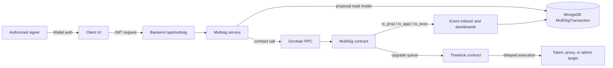
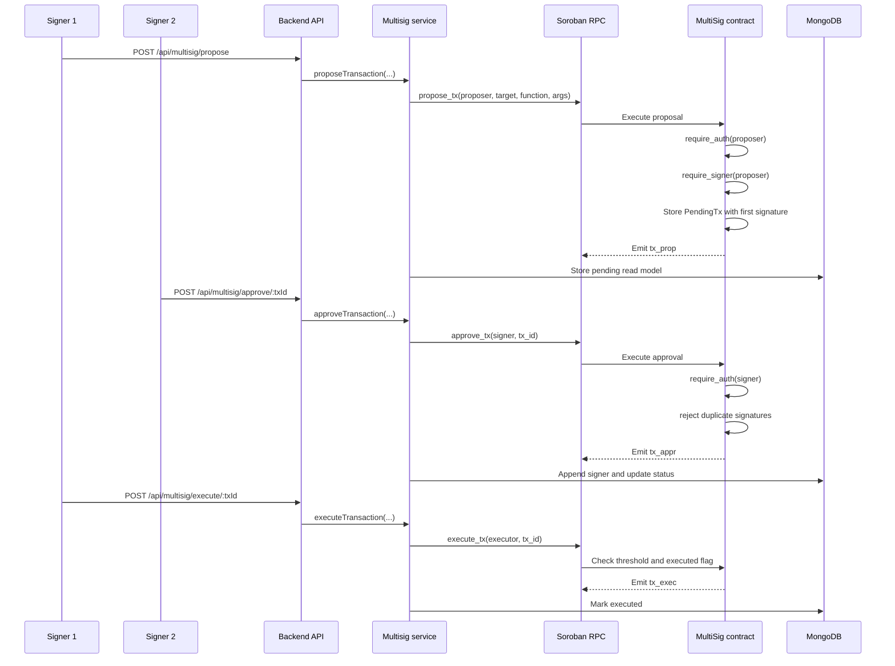
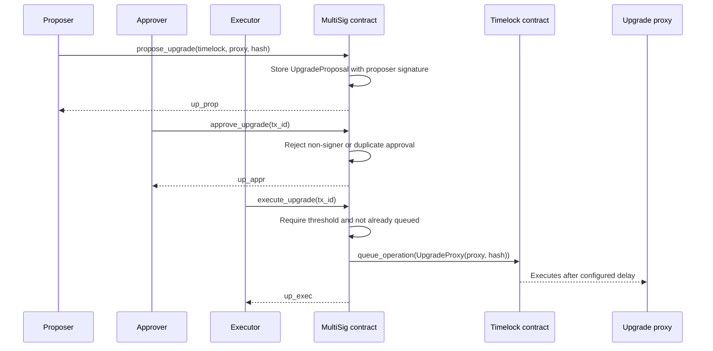

# Multisig Architecture

This document describes the SoroMint multisig architecture across Soroban
contracts, the backend coordination API, the MongoDB proposal read model, and
the client-facing service layer. The goal of the subsystem is to move sensitive
token and protocol administration from a single operator key to a threshold of
authorized signers.

## Scope and Responsibilities

The multisig system has four cooperating layers:

- **Multisig Soroban contract**: Stores signers, threshold, pending
  transactions, and upgrade proposals. It enforces signer authentication and
  threshold checks.
- **Timelock and target contracts**: Receive queued upgrade operations or
  administrative calls after the multisig threshold is satisfied.
- **Backend coordination API**: Authenticates API callers, maps proposal,
  approval, execution, and read requests to the multisig service, and persists
  proposal state in MongoDB.
- **Client service and UI**: Fetch multisig configuration, list proposals,
  submit new proposals, and ask signers to approve them.



The contract is the authority for signer eligibility, duplicate approval
prevention, threshold enforcement, and execution status. The backend read model
is useful for lists and dashboards, but it should be reconciled against the
contract for security-sensitive execution decisions.

## Contract Model

The main multisig contract lives in `contracts/multisig/src/lib.rs`.

### Configuration

| Key | Storage | Purpose |
| --- | --- | --- |
| `Signers` | Instance | Authorized signer address list. |
| `Threshold` | Instance | Minimum number of signer approvals required. |
| `TxCounter` | Instance | Monotonic ID generator shared by transaction and upgrade proposals. |

Initialization rejects a zero threshold, a threshold larger than the signer
count, and repeated initialization.

### Pending Transaction

`PendingTransaction` is stored as `PendingTx(tx_id)` and contains:

- `id`
- `target`
- `function`
- serialized `args`
- signer `signatures`
- `executed`

The normal transaction path is:

1. A signer calls `propose_tx`.
2. The proposer is authenticated with `require_auth`.
3. The proposer must exist in the stored signer set.
4. The proposal is persisted with the proposer's signature already counted.
5. Additional signers call `approve_tx`.
6. `execute_tx` marks the transaction executed only after the stored signature
   count reaches the configured threshold.



### Upgrade Proposal

The same signer and threshold model is used for upgrade governance through:

- `propose_upgrade(proposer, timelock, proxy, new_wasm_hash)`
- `approve_upgrade(signer, tx_id)`
- `execute_upgrade(executor, tx_id)`
- `get_upgrade(tx_id)`

`execute_upgrade` does not swap contract code directly. It serializes a
`TimelockFactoryOperation::UpgradeProxy(proxy, wasm_hash)` and invokes
`queue_operation` on the configured Timelock contract. The Timelock admin must
therefore be the multisig contract for the cross-contract authorization model
to work.



This creates a two-stage governance boundary: multisig approval first, delayed
Timelock execution second.

## Access-Control Multisig Component

`contracts/access/src/multisig.rs` implements a smaller
`MultiSigAccessControl` contract for high-risk operations such as fee
withdrawal. It stores a `MultiSigConfig`, pending operations keyed by an
operation hash, and per-signer approvals.

It is useful when a subsystem only needs operation approval state and does not
need the richer generic transaction or upgrade-proposal model. It emits:

- `op_crt`
- `op_apr`
- `op_exe`

Like the main multisig contract, it requires signer authentication for proposal
and approval, counts approvals across the configured signer set, and rejects
execution before threshold is met.

## Backend API and Read Model

Backend routes are implemented in `server/routes/multisig-routes.js`, service
logic in `server/services/multisig-service.js`, and persistence in
`server/models/MultiSigTransaction.js`.

| Backend route | Service method | Contract operation |
| --- | --- | --- |
| `POST /api/multisig/propose` | `proposeTransaction` | `propose_tx` |
| `POST /api/multisig/approve/:txId` | `approveTransaction` | `approve_tx` |
| `POST /api/multisig/execute/:txId` | `executeTransaction` | `execute_tx` |
| `GET /api/multisig/pending/:multiSigContractId` | `getPendingTransactions` | MongoDB pending query |
| `GET /api/multisig/transaction/:txId` | `getTransaction` | MongoDB transaction query |
| `GET /api/multisig/signers/:multiSigContractId` | `getSigners` and `getThreshold` | `get_signers`, `get_threshold` |

The MongoDB model stores the contract ID, target token contract, target
function, serialized function arguments, proposer, collected signatures,
required signature count, status, execution metadata, and expiry time. Indexes
support pending-by-contract views and status/expiry cleanup.

The backend also narrows allowed target functions to:

- `mint`
- `burn`
- `transfer_ownership`
- `set_fee_config`
- `pause`
- `unpause`

This server-side allowlist keeps the HTTP API from acting as a generic
arbitrary-call endpoint.

## Client Service Layer

`client/src/services/multisigService.js` normalizes backend responses for the
UI. It exposes:

- configuration reads
- proposal reads
- version reads
- combined status fetches
- proposal submission
- proposal signing

The client includes fallback payload support for undeployed or unavailable
backend endpoints. That is useful for demos, but production flows should make
the fallback state visually distinct from verified on-chain or backend data.

### Route naming note

The backend currently exposes `pending`, `transaction`, and `signers` route
names, while the client service references `config`, `proposals`, `version`,
and proposal-specific signing paths. Treat this as an integration boundary to
verify when wiring a production UI. The contract and backend route definitions
are the authoritative paths described above.

## Event Flow

The main multisig contract emits compact proposal, approval, and execution
events:

| Event | Meaning |
| --- | --- |
| `tx_prop` | Standard transaction proposed. |
| `tx_appr` | Standard transaction approved by a signer. |
| `tx_exec` | Standard transaction marked executed. |
| `up_prop` | Upgrade proposal created. |
| `up_appr` | Upgrade proposal approved. |
| `up_exec` | Upgrade proposal queued on the Timelock. |

These events are suitable for audit trails, signer notifications, and
dashboard projections. Consumers should handle duplicate or delayed event
delivery and should not treat a missing event-indexer row as proof that a
contract-side proposal does not exist.

## Security Invariants

- Only configured signers can propose, approve, or execute.
- Every signer-controlled mutation requires Soroban `require_auth`.
- The proposer signature counts as the first approval.
- A signer cannot approve the same main multisig proposal twice.
- A transaction or upgrade cannot be executed twice.
- Execution requires the current stored threshold, not a client-provided count.
- Upgrade execution queues a Timelock operation instead of bypassing the delay.
- Backend JWT authentication is a convenience and audit layer; contract signer
  checks remain the final authorization boundary.

## Operational Risks

- Backend `MultiSigTransaction` status can drift from contract state if the
  service call succeeds but persistence fails, or if indexing lags.
- Proposal expiration is enforced by the backend read model, not by the main
  multisig contract shown here.
- Generic transaction `execute_tx` records execution in the multisig contract;
  any actual target-call semantics must be verified by the integration that
  consumes the proposal.
- Frontend fallback data must not be mistaken for live governance state.
- Signer rotation and emergency signer compromise handling should be performed
  through an explicit governance process and tested before production use.

## Testing and Verification Pointers

Contract tests live in `contracts/multisig/src/test.rs`,
`contracts/access/src/test_multisig.rs`, and
`contracts/upgradeable/src/test_governance.rs`. Existing coverage includes
threshold checks, duplicate execution prevention, unauthorized proposer
rejection, upgrade queueing through Timelock, and delayed execution behavior.

When changing this subsystem, verify at least:

```bash
cargo test -p soromint-multisig
```

and run the backend/API tests that cover `server/routes/multisig-routes.js`,
`server/services/multisig-service.js`, and `MultiSigTransaction` persistence.
