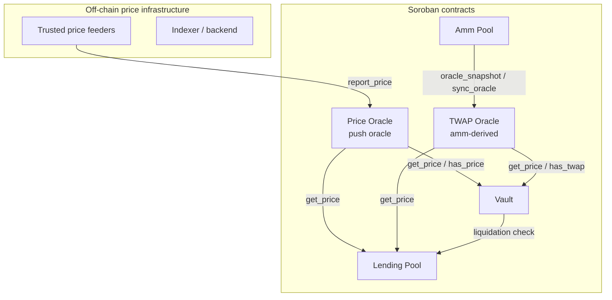
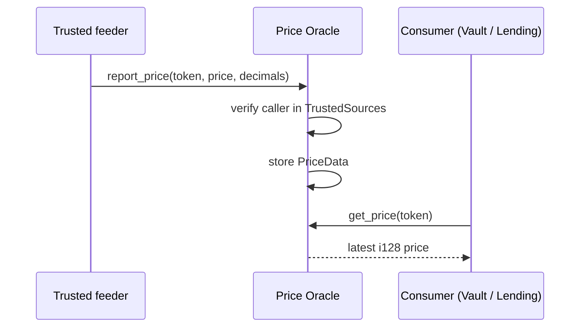
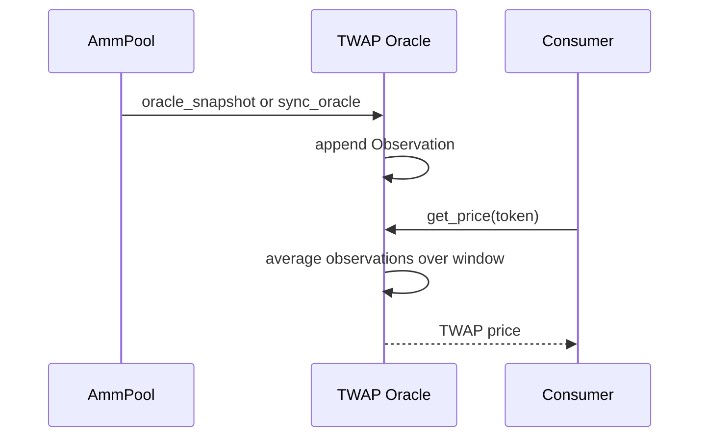
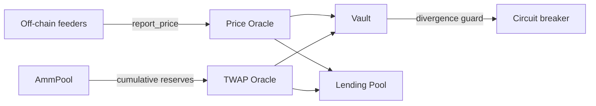

# Oracle Architecture

SoroMint relies on a dual-oracle design to price assets on-chain. The system combines a **push-style Price Oracle** with a **TWAP Oracle** derived from AMM pool observations. Consumers — the Vault, Lending Pool and AMM Pool — choose the oracle source that best fits their risk model, and the Vault can cross-check both sources to detect divergence.

## Price Oracle (push oracle)

`contracts/oracle/src/lib.rs`

The Price Oracle is a permissioned push oracle. An admin initializes the contract and maintains a list of `TrustedSources`. Each trusted source calls `report_price(token, price, decimals, timestamp)` to publish a price update for a specific asset. The contract stores the latest `PriceData` per token and exposes it through `get_price` and `has_price`.

Key data structures:

- `PriceData` — `{ price, timestamp, source, decimals }`
- `USDValue` — `{ token_amount, usd_value, price_used, timestamp }`
- `ConfigKey::TrustedSources` — the allow-list of reporter addresses.

The consumer-facing interface is intentionally small:

## TWAP Oracle (AMM-derived)

`contracts/twap_oracle/src/lib.rs`

The TWAP Oracle computes manipulation-resistant time-weighted average prices from `AmmPool` cumulative-price observations. It is a pull oracle in the sense that it reads on-chain AMM state rather than relying on external signers.

A pool feed is registered via `set_pool_feed(pool, token, quote_token, cardinality, min_interval)`. The oracle then stores `Observation` entries containing cumulative price reserves and timestamps. When a consumer asks for a price, the contract averages observations over the configured window.

Key data structures:

- `PoolFeed` — registration metadata for an AMM pool.
- `Observation` — `{ timestamp, price_cumulative_token, price_cumulative_quote }`
- `TwapResult` — `{ token_price, quote_price, window, timestamp }`

## Consumers

### Vault

`contracts/vault/src/oracle.rs`

The Vault calls both oracles. It uses the Price Oracle for current market prices and the TWAP Oracle as a slower, manipulation-resistant reference. If the two prices diverge beyond a configured threshold, the Vault pauses liquidations through a circuit breaker.

### Lending Pool

`contracts/lending_pool/src/oracle.rs`

The Lending Pool reads prices to value collateral and debt. It can use either oracle depending on the asset and risk configuration.

### AMM Pool

`contracts/amm_pool/src/oracle.rs`

The AMM Pool exposes cumulative-price snapshots that the TWAP Oracle consumes. It does not act as a price consumer in the same way as Vault and Lending, but its oracle accumulator is the data source for the TWAP.

## Data flow summary

## Decimals and scale

Both oracles target 7 decimal places (`PRICE_SCALE = 10_000_000`), so a price of `1.5 USD` is represented as `15_000_000`. Consumers must scale token amounts accordingly before comparing prices or computing USD values.

## Failure modes

| Scenario | Behaviour |
|---|---|
| Price Oracle has no price for a token | `has_price` returns `false`; consumer may fall back to TWAP or revert. |
| TWAP Oracle has insufficient history | `has_twap` returns `false`; consumer may fall back to Price Oracle or revert. |
| Price and TWAP diverge beyond threshold | Vault circuit breaker pauses liquidations until admin intervention. |
| Stale Price Oracle data | Consumers can enforce a maximum age check against the `timestamp` field. |

## Deployment topology

A production deployment typically contains:

- One `PriceOracle` contract.
- One `TwapOracle` contract.
- Multiple `AmmPool` contracts registered as feeds in the TWAP Oracle.
- One `Vault` and one `LendingPool` reading from both oracles.

Administrators rotate trusted sources through `add_trusted_source` / `remove_trusted_source`, and adjust TWAP windows through `set_default_window`.
