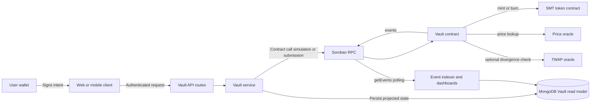
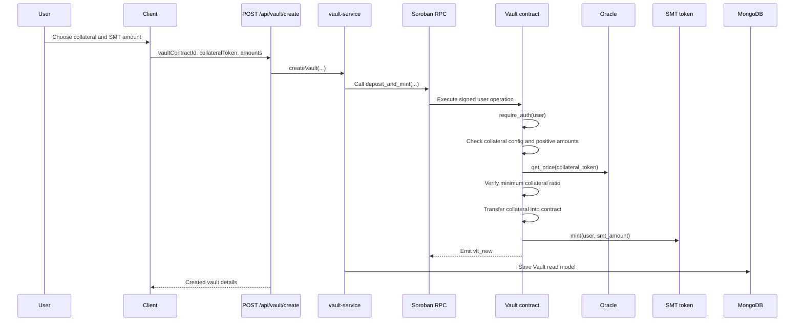
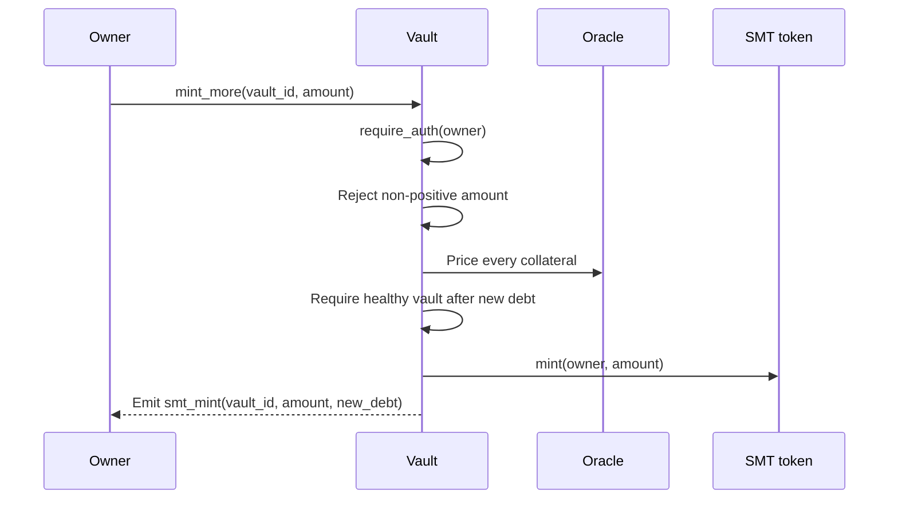
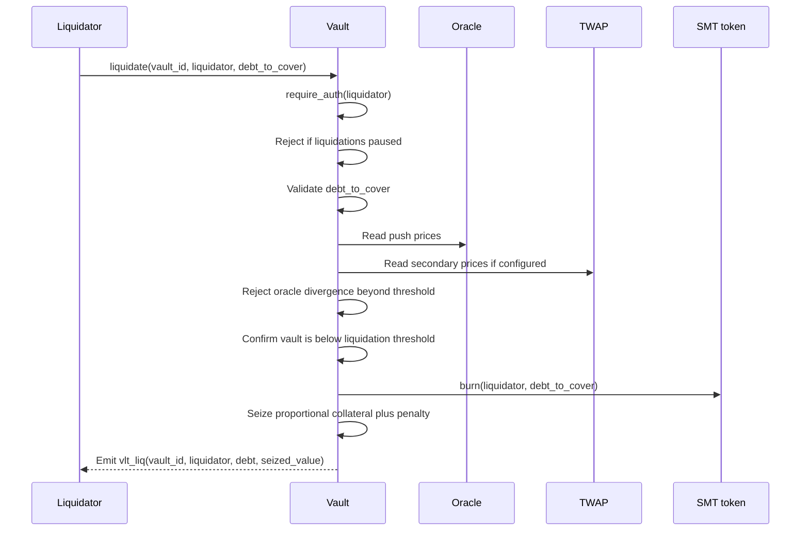

# Vault Architecture

This document describes how the SoroMint Vault system is wired across the
Soroban contract, the Node.js backend, and the off-chain persistence layer.
The contract remains the source of truth for collateral, debt, authorization,
health checks, minting, repayment, and liquidation. The backend exposes API
routes, submits or simulates contract calls through Soroban RPC, and maintains
a MongoDB read model for application queries.

## Scope and Responsibilities

The Vault system has four main layers:

- **Soroban network**: Executes signed Vault, token, and oracle contract calls.
- **Vault contract**: Stores vault positions, collateral configuration, debt,
  liquidation state, TWAP configuration, and emitted events.
- **Off-chain backend**: Authenticates API callers, maps HTTP requests to Vault
  contract entrypoints, and updates the MongoDB vault read model.
- **Client applications**: Collect user intent, wallet signatures, vault
  contract IDs, collateral tokens, and token amounts before calling the backend
  or the Soroban network.



The backend model is a projection. A UI can use it for fast lists, owner
queries, liquidation queues, and status pages, but correctness-sensitive flows
should reconcile against the Vault contract before acting.

## On-Chain Contract Model

The Vault contract is implemented in `contracts/vault/src/lib.rs`, with storage
types in `contracts/vault/src/storage.rs` and event helpers in
`contracts/vault/src/events.rs`.

### Configuration

| Key | Storage | Purpose |
| --- | --- | --- |
| `Admin` | Instance | Address authorized to update collateral, TWAP, and liquidation-pause settings. |
| `SmtToken` | Instance | Token contract used when minting and burning SMT debt. |
| `Oracle` | Instance | Push oracle used to price collateral assets. |
| `Counter` | Instance | Monotonic counter for vault IDs. |
| `TwapOracle` | Instance | Optional secondary price feed used for liquidation safety checks. |
| `DivergenceBps` | Instance | Maximum accepted push-oracle versus TWAP divergence. |
| `LiqPaused` | Instance | Global liquidation pause flag. |

Collateral configuration is stored per collateral token address and includes:

- `enabled`
- `min_collateral_ratio`
- `liquidation_threshold`
- `liquidation_penalty`

The default constants are 150% minimum collateralization, 130% liquidation
threshold, and 10% liquidation penalty, expressed in basis points in the
contract.

### Vault Position

Each vault position stores:

- `owner`: the address that must authorize owner-controlled changes
- `collaterals`: a map of collateral token addresses to i128 balances
- `debt`: outstanding SMT debt
- `created_at`: ledger timestamp at vault creation

User-to-vault lookup is stored separately as `UserVaults(Address)`, allowing
clients and services to list a user's vault IDs without scanning all vaults.

## Core Flows

### Create Vault and Mint SMT

`deposit_and_mint(user, collateral_token, collateral_amount, smt_amount)` is
the entry point for opening a vault.



The contract enforces positive amounts, supported collateral, sufficient
collateralization, token transfer, vault ID allocation, and SMT minting. The
backend persists a local `Vault` document after the contract call succeeds.

### Add Collateral

`add_collateral_to_vault(vault_id, collateral_token, amount)` increases the
collateral backing an existing position.

1. The contract loads the position by `vault_id`.
2. The position owner must authorize the operation.
3. The collateral token must be supported and enabled.
4. The contract transfers collateral from the owner into the Vault contract.
5. The position's collateral map is updated and `vlt_add` is emitted.
6. The backend read model increments or adds the matching collateral entry.

This flow improves the health ratio and does not mint additional SMT.

### Mint More SMT

`mint_more(vault_id, smt_amount)` increases debt against existing collateral.



The important invariant is that debt can only increase if the vault remains at
or above the required collateral ratio after the mint.

### Repay and Withdraw

`repay_and_withdraw(vault_id, repay_amount, collateral_token, withdraw_amount)`
lets the owner reduce debt, withdraw collateral, or do both in one operation.

The contract rejects negative values, burns SMT when `repay_amount` is positive,
checks collateral availability before withdrawal, and re-runs the health check
when debt remains after a withdrawal. The operation emits `vlt_rpay`.

### Liquidation

`liquidate(vault_id, liquidator, debt_to_cover)` is available when a vault falls
below the configured liquidation threshold.



Liquidation uses the push oracle for valuation and can optionally compare it
against a TWAP oracle. Administrators can pause liquidations directly, and any
caller can trip the oracle circuit breaker when configured price feeds diverge
beyond the stored basis-point threshold.

## Backend API and Read Model

The backend route layer is in `server/routes/vault-routes.js`; service logic is
in `server/services/vault-service.js`; MongoDB persistence is defined in
`server/models/Vault.js`.

| Route | Service method | Contract entrypoint or read |
| --- | --- | --- |
| `POST /api/vault/create` | `createVault` | `deposit_and_mint` |
| `POST /api/vault/:vaultId/add-collateral` | `addCollateral` | `add_collateral` intent |
| `POST /api/vault/:vaultId/mint` | `mintMore` | `mint_more` |
| `POST /api/vault/:vaultId/repay` | `repayAndWithdraw` | `repay_and_withdraw` |
| `POST /api/vault/:vaultId/liquidate` | `liquidate` | `liquidate` |
| `GET /api/vault/:vaultId` | `getVault` | `get_vault` |
| `GET /api/vault/:vaultId/health` | `getVaultHealth` | `get_vault_health` |
| `GET /api/vault/user/:userAddress` | `getUserVaults` | MongoDB owner/status query |
| `GET /api/vault/liquidatable/list` | `getLiquidatableVaults` | MongoDB ratio/status query |

The MongoDB `Vault` document stores the vault ID, contract address, owner,
collateral list, debt, collateralization ratio, status, timestamps, and
liquidation history. It also indexes owner/status and
collateralizationRatio/status for dashboard and liquidation-list queries.

## Event Flow

The Vault contract emits compact event names for each important state change:

| Event | Meaning |
| --- | --- |
| `init` | Vault contract initialized. |
| `coll_add` | Collateral token configuration added or updated. |
| `vlt_new` | Vault created and initial debt minted. |
| `vlt_add` | Collateral added to an existing vault. |
| `smt_mint` | Additional SMT minted. |
| `vlt_rpay` | Debt repaid and/or collateral withdrawn. |
| `vlt_liq` | Vault partially or fully liquidated. |
| `twap_cfg` | TWAP oracle configured. |
| `liq_pause` | Liquidations paused by admin or circuit breaker. |
| `liq_unp` | Liquidations unpaused. |

These events are suitable for analytics, notifications, and read-model repair.
Consumers should still treat contract storage as authoritative when deciding
whether a vault is healthy, liquidatable, or eligible for withdrawal.

## Failure Modes and Trust Boundaries

- User-controlled operations require the relevant wallet address to authorize
  the contract call.
- Admin operations require the stored admin address.
- Liquidation is blocked when the global pause flag is set.
- Liquidation checks oracle divergence before burning SMT and seizing
  collateral when the TWAP oracle is configured.
- Backend persistence can lag or fail independently of the contract state.
- Amounts are stored as integer token units; UI layers should format them
  without changing precision.
- A stale MongoDB `collateralizationRatio` must not be the only signal used for
  liquidation, withdrawal, or additional minting.

## Testing and Verification Pointers

Vault contract tests live in `contracts/vault/src/test.rs` and cover
initialization, collateral configuration, reentrancy guard behavior,
liquidation pause behavior, oracle divergence checks, the circuit breaker, and
aligned-oracle liquidation. Backend tests should exercise route validation,
service-to-contract argument mapping, read-model updates, and stale read-model
handling.

When changing this subsystem, verify at least:

```bash
cargo test -p soromint-vault
```

and run the backend test target that covers `server/routes/vault-routes.js` and
`server/services/vault-service.js`.
